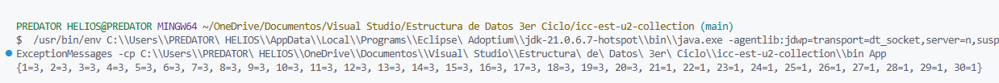
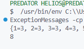
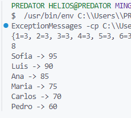

# Práctica: Estructuras No Lineales - 

## Autor
- Nombre: Derlis Yupangui
- Carrera/Curso: Estructura de Datos

##  Nombre de la práctica - Fecha
- Práctica: Maps Ejercicios
- Fecha: [2026-01-19]

## Descripción
En esta práctica se trabajó con estructuras no lineales del tipo Map en Java, implementando métodos para almacenar y procesar datos mediante HashMap, LinkedHashMap y TreeMap. Se desarrollaron ejercicios para el conteo de elementos duplicados y la manipulación de colecciones, reforzando el uso de claves, valores y recorridos de mapas.

## Evidencias
### Captura 1 

---

## Descripción
En este ejercicio se implementó un método que permite identificar el primer número que no se repite dentro de una lista de enteros, respetando el orden de aparición. Para ello se utilizó una estructura Map que almacena la cantidad de veces que aparece cada elemento, logrando una solución eficiente con complejidad O(N).

## Evidencias
### Captura 1 

---

## Descripción
En este ejercicio se desarrolló un ranking de jugadores a partir de sus puntajes, conservando únicamente el mayor puntaje cuando un jugador aparece más de una vez. Se utilizó una estructura Map junto con un comparador personalizado para ordenar los resultados de forma descendente sin emplear listas auxiliares.

## Evidencias
### Captura 1 
